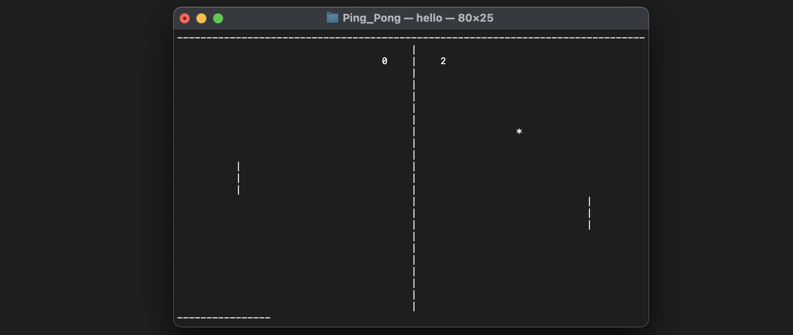

# PING PONG GAME

It's my adaptation of the famous ping pong game.

  

To compile it please install *ncurses*

```bash
   brew install ncurses
```
  
To RUN this game, go to the right folder and type:

```bash
   gcc -o pong pong_Pro.c  -lncurses && ./pong 
``` 

First player can control his rocker throw:    **A/Z**             
                                    Scond:    **K/M**